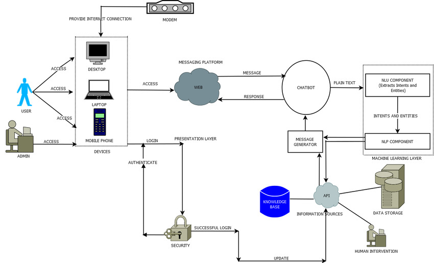
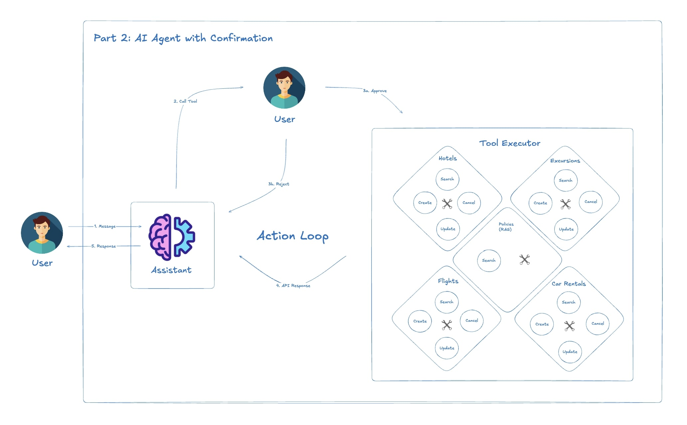
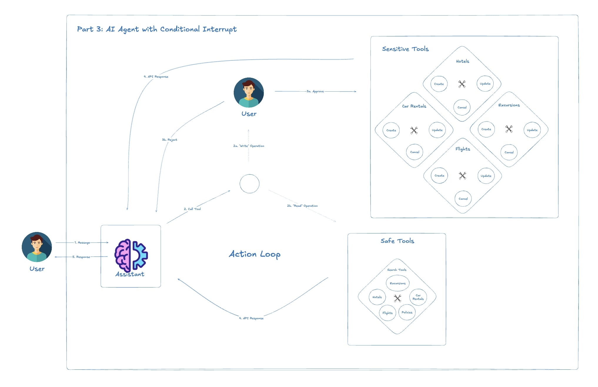

# AI Agent Evolution for Travel Assistance

## Overview

The Travel Booking AI Agent is a sophisticated system designed to assist users with all aspects of travel planning and management. This AI Agent can help users search for flights, manage bookings, find accommodations, arrange car rentals, and discover local excursions. The system interacts with users through natural language conversation, understanding complex requests and taking appropriate actions on the user's behalf.

This implementation demonstrates how AI Agents can replace traditional customer service representatives in the travel industry by providing 24/7 assistance, handling routine tasks automatically, and seamlessly connecting users to the right specialized services. The Travel Booking AI Agent can access real-time flight information, company policies, and customer bookings to provide personalized assistance tailored to each user's unique situation.


## Table of Contents

- [Why AI Agents](#why-ai-agents)
  - [Traditional Chatbots vs. AI Agents](#traditional-chatbots-vs-ai-agents)
  - [Architecture Evolution](#architecture-evolution)
- [Zero-shot AI Agent](#zero-shot-ai-agent)
  - [Architecture](#architecture)
  - [Implementation Details](#implementation-details)
  - [Advantages](#advantages)
  - [Limitations](#limitations)
  - [Example Conversation](#example-conversation)
- [AI Agent with Confirmation](#ai-agent-with-confirmation)
  - [Architecture](#architecture-1)
  - [Implementation Details](#implementation-details-1)
  - [Advantages](#advantages-1)
  - [Limitations](#limitations-1)
  - [Example Conversation](#example-conversation-1)
- [AI Agent with Conditional Interrupt](#ai-agent-with-conditional-interrupt)
  - [Architecture](#architecture-2)
  - [Implementation Details](#implementation-details-2)
  - [Advantages](#advantages-2)
  - [Limitations](#limitations-2)
  - [Example Conversation](#example-conversation-2)
- [Supervisor-Worker AI Agent Architecture](#supervisor-worker-ai-agent-architecture)
  - [Architecture](#architecture-3)
  - [Implementation Details](#implementation-details-3)
  - [Advantages](#advantages-3)
  - [Limitations](#limitations-3)
  - [Example Conversation](#example-conversation-3)
- [Conclusion](#conclusion)

## Why AI Agents

Traditional machine learning chatbots have long been used for customer interactions, but they've had significant limitations. They typically operated on predefined decision trees or simple pattern matching, making them rigid and unable to adapt to complex user needs. While they could maintain basic conversations, their ability to understand context, reason, and take appropriate actions on behalf of users was severely limited.

AI Agents represent a paradigm shift in this domain. By leveraging advanced Large Language Models (LLMs) and structured tool usage frameworks, we can build systems that not only understand user requests but can actively execute actions on their behalf. Here's how the architecture has evolved:

### Traditional Chatbots vs. AI Agents



Traditional chatbots could only respond based on their pre-programmed knowledge and patterns. Even advanced LLMs like ChatGPT have limitations - they have a knowledge cutoff date and can't access external tools or systems. While they can generate human-like responses, they can't actually "do" anything in the real world or access up-to-date information.


AI Agents overcome these limitations by combining LLMs with:
- **Tools Integration**: Ability to call external functions, APIs, and databases
- **Context Management**: Maintaining conversational state across interactions
- **Decision-Making**: Determining when and how to use tools appropriately
- **Feedback Loops**: Learning from outcomes to improve future responses


## LLMs: The Game Changer

The introduction of Large Language Models (LLMs) like GPT revolutionized conversational AI in several key ways:

### First Generation: Basic LLM Chatbots (e.g., ChatGPT)

- Deep natural language understanding that can interpret complex requests
- Human-like responses that flow naturally in conversation
- Ability to adapt to different user communication styles
- Access to broad knowledge domains encoded in their training data

However, these basic LLM applications still had critical limitations:

- Knowledge cutoff dates with no access to current information
- No ability to interact with external systems or databases
- Unable to perform actions on behalf of users
- Limited persistent memory across conversations

A stand-alone LLM like ChatGPT can discuss flight options in theory, but cannot actually check current availability, access a user's booking details, or make reservations in real-world systems.

### Second Generation: AI Agents
AI Agents overcome these limitations by combining LLMs with:

- Tools Integration: Ability to call external functions, APIs, and databases
- Context Management: Maintaining conversational state across interactions
- Decision-Making: Determining when and how to use tools appropriately
- Feedback Loops: Learning from outcomes to improve future responses

This evolution enables AI systems to move beyond conversation into action, turning them from passive information providers into active assistants.


### Architecture Evolution

In this implementation, we'll explore a progressive evolution of AI Agent architectures:

1. **Zero-shot AI Agent**: The fundamental architecture where an LLM uses a set of tools directly without additional safeguards. This represents the simplest implementation but lacks necessary controls.

2. **AI Agent with Confirmation**: Adding a confirmation step before executing any tool action. This provides safety but can be inefficient when requiring confirmation for even routine or harmless actions.

3. **AI Agent with Conditional Interrupt**: Implementing selective confirmation by dividing tools into "safe" and "sensitive" categories. Safe tools execute automatically, while sensitive tools require human confirmation.

4. **Supervisor-Worker AI Agent Architecture**: The most advanced implementation where specialized "worker" agents handle specific domains (flights, hotels, car rentals, etc.), while a "supervisor" agent routes requests appropriately. This separation of concerns allows for domain-specific optimization.

Each of these architectures builds upon the previous one, adding sophistication, safety, and improved user experience. Let's explore each in detail.

## Zero-shot AI Agent


The Zero-shot AI Agent represents the most basic implementation of an AI Agent system. It directly connects an LLM to a set of tools, allowing it to choose which tool to use based solely on its reasoning.

### Architecture

In this model:
1. The user sends a message to the agent
2. The agent, powered by an LLM, decides which tool to use (if any)
3. The tool executes the action directly without confirmation
4. Results are returned to the agent, which generates a response
5. The response is sent to the user

### Implementation Details

The key components include:
- A state graph that manages message flow
- The assistant node with access to all available tools
- Tool nodes that execute the actual functions

```python
# Core components from zero_shot_agent.py
builder = StateGraph(State)
builder.add_node("assistant", Assistant(assistant_runnable))
builder.add_node("tools", create_tool_node_with_fallback(all_tools))
builder.add_edge(START, "assistant")
builder.add_conditional_edges("assistant", tools_condition)
builder.add_edge("tools", "assistant")
graph = builder.compile(checkpointer=memory)
```

This architecture gives the agent complete freedom to use any tool without restrictions. While powerful, it lacks safety mechanisms to prevent unwanted actions.

### Advantages
- Simple implementation
- Minimal latency (no confirmation steps)
- Streamlined user experience for straightforward tasks

### Limitations
- No safeguards against incorrect tool usage
- Cannot confirm user intent before taking potentially significant actions
- User has no visibility into or control over the agent's actions

### Example Conversation

[PLACEHOLDER FOR ZERO-SHOT AGENT CONVERSATION SCREENSHOT]

As shown in the conversation above, the agent can directly make flight changes, book hotels, and more without any confirmation step. While efficient, this could lead to unintended consequences if the agent misinterprets user intent.

## AI Agent with Confirmation



The AI Agent with Confirmation architecture adds a critical safety layer by requiring human approval before executing any tool action.

### Architecture

This model extends the zero-shot architecture with an interrupt mechanism:
1. The user sends a message to the agent
2. The agent decides which tool to use
3. **Before execution, the system pauses and presents the intended action to the user**
4. The user must explicitly approve or reject the action
5. Only with approval will the tool execute
6. Results flow back to the agent for response generation

### Implementation Details

The key difference is the addition of an interruption point before any tool execution:

```python
# From agent_with_confirmation.py
graph = builder.compile(
    checkpointer=memory,
    interrupt_before=["tools"],
)
```

When handling user confirmations:

```python
snapshot = graph.get_state(config)
while snapshot.next:
    user_input = input(
        "Do you approve of the above actions? Type 'y' to continue;"
        "otherwise, explain your requested changed. \n\n"
    )
    if user_input.strip() == "y":
        result = graph.invoke(
            None,
            config,
        )
    else:
        result = graph.invoke(
            {
                "messages": [
                    ToolMessage(
                        tool_call_id=event["messages"][-1].tool_calls[0]["id"],
                        content=f"API call denied by user. Reasoning: '{user_input}'. Continue assisting, accounting for the user's input.",
                    )
                ]
            },
            config,
        )
```

### Advantages
- Provides complete oversight to users
- Prevents unintended actions
- Allows users to correct misunderstandings before execution

### Limitations
- Interrupts flow even for routine or low-risk actions
- Creates friction in the user experience
- Increases the number of interactions required to complete tasks

### Example Conversation

[PLACEHOLDER FOR AI AGENT WITH CONFIRMATION CONVERSATION SCREENSHOT]

In this conversation, you can see that the user must explicitly approve each action, including simple searches. While safe, this can become tedious for complex tasks requiring multiple tool calls.

## AI Agent with Conditional Interrupt



The Conditional Interrupt architecture represents a more balanced approach - dividing tools into "safe" and "sensitive" categories with different handling for each.

### Architecture

This model refines the confirmation process:
1. The user sends a message to the agent
2. The agent decides which tool to use
3. The system checks if the selected tool is in the "sensitive" category
   - If sensitive: interrupt and require user confirmation
   - If safe: execute without interruption
4. Results flow back to the agent for response generation

### Implementation Details

The key innovation is the separation of tools and selective interruption:

```python
# From agent_with_conditional_interrupt.py
safe_tools = [
    TavilySearchResults(max_results=1),
    fetch_user_flight_information,
    search_flights,
    lookup_policy,
    search_car_rentals,
    search_hotels,
    search_trip_recommendations,
]

sensitive_tools = [
    update_ticket_to_new_flight,
    cancel_ticket,
    book_car_rental,
    update_car_rental,
    cancel_car_rental,
    book_hotel,
    update_hotel,
    cancel_hotel,
    book_excursion,
    update_excursion,
    cancel_excursion,
]

# Routing based on tool category
def route_tools(state: State):
    next_node = tools_condition(state)
    if next_node == END:
        return END
    ai_message = state["messages"][-1]
    first_tool_call = ai_message.tool_calls[0]
    if first_tool_call["name"] in sensitive_tool_names:
        return "sensitive_tools"
    return "safe_tools"

# Only interrupt before sensitive tools
graph = builder.compile(
    checkpointer=memory,
    interrupt_before=["sensitive_tools"],
)
```

### Advantages
- Balanced approach between safety and efficiency
- Smooth experience for routine actions
- Maintains control over significant actions (booking, cancellations, etc.)

### Limitations
- Requires careful categorization of tools
- Still creates some interruption in the flow
- May miss some edge cases where a normally safe tool becomes risky in context

### Example Conversation

[PLACEHOLDER FOR AI AGENT WITH CONDITIONAL INTERRUPT CONVERSATION SCREENSHOT]

In this conversation, the agent can directly search for information but requires confirmation before booking a hotel or changing a flight. This creates a more natural experience while maintaining safety for consequential actions.

## Supervisor-Worker AI Agent Architecture


The most advanced architecture implements a multi-agent system with specialized workers overseen by a supervisor agent.

### Architecture

This sophisticated model involves multiple specialized agents:
1. A supervisor agent that receives user messages and determines the domain
2. Domain-specific worker agents for flights, hotels, car rentals, and excursions
3. A routing mechanism to direct conversations to the appropriate worker
4. A feedback loop for workers to return control to the supervisor
5. State management to track which agent is currently handling the conversation

### Implementation Details

The key components include:

1. Specialized prompts for each worker domain:

```python
# From multi_agent_workflow.py
flight_booking_prompt = ChatPromptTemplate.from_messages([
    (
        "system",
        "You are a specialized assistant for handling flight updates. "
        "The primary assistant delegates work to you whenever the user needs help updating their bookings. "
        "Confirm the updated flight details with the customer and inform them of any additional fees. "
        # Additional specialized instructions...
    ),
    ("placeholder", "{messages}"),
])

# Similar specialized prompts for hotel_booking, car_rental_booking, and excursion_booking
```

2. Routing and control flow delegation:

```python
def route_primary_assistant(state: State):
    route = tools_condition(state)
    if route == END:
        return END
    tool_calls = state["messages"][-1].tool_calls
    if tool_calls:
        if tool_calls[0]["name"] == ToFlightBookingAssistant.__name__:
            return "enter_update_flight"
        elif tool_calls[0]["name"] == ToCarRentalBookingAssistant.__name__:
            return "enter_book_car_rental"
        # Additional routing...
```

3. Control transfer between agents:

```python
class CompleteOrEscalate(BaseModel):
    """
    A tool to mark the current task as completed and/or to escalate control of the dialog to the main assistant,
    who can re-route the dialog based on the user's needs.
    """
    cancel: bool = True
    reason: str
```

### Advantages
- Domain-specific expertise through specialized prompts
- Clean separation of concerns
- Ability to optimize each worker for its specific tasks
- Flexibility to add new domains without modifying existing ones

### Limitations
- Increased complexity in implementation and maintenance
- Potential for disjointed experiences if transitions aren't smooth
- Higher computational requirements from managing multiple agents

### Example Conversation

[PLACEHOLDER FOR SUPERVISOR-WORKER AI AGENT CONVERSATION SCREENSHOT]

In this conversation, you can see how the supervisor seamlessly routes the discussion to specialized workers for flights, hotels, car rentals, and excursions. The transitions are designed to be invisible to the user, creating a unified experience despite the complex architecture behind the scenes.

## Conclusion

The evolution of AI Agents from simple zero-shot implementations to sophisticated supervisor-worker architectures demonstrates the rapid advancement in this field. Each architecture offers different trade-offs between simplicity, safety, efficiency, and specialization.

For production applications, the choice of architecture should be guided by:

1. The stakes involved in the actions the agent can take
2. The complexity and diversity of the domain
3. The desired level of user control versus automation
4. The computational resources available

The most sophisticated Supervisor-Worker architecture provides the best balance for complex domains like travel assistance, where specialized knowledge and careful action execution are critical to user satisfaction and safety.

As AI Agent technology continues to evolve, we can expect even more sophisticated architectures that further enhance the balance between autonomy and control, creating increasingly valuable and trustworthy assistants for a wide range of applications.